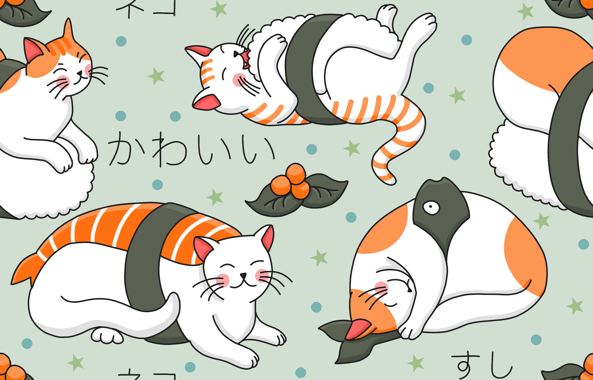

# Koko - an Overview

Koko is a startup that [integrates mental health resources in pre-existing social media platforms to provide younger adults an easier access point to mental health care]().  They partner with online communities to help find and treat at-risk individuals directly on their platform using online interventions on Koko. They use a keyword-trigger design system in which certain negative-thought-keywords will trigger the interface to open up resources for mental health. In this design process, we are creating a plug-in feature linked to a Koko mobile app. 

# Designing Koko
A mobile app format was chosen because many personal conversations for young adolescents and adults happen on phones and messaging apps. In comparison, laptops and desktops may be used just for working purposes. The simple plug-in features would transition better on the phone because it is a simple screen change. 

This Koko mobile app includes a diverse set of features such as [color therapy](), [online consulting](), and also [virtual pet therapy]() powered by cognitive behavioral therapy (CBT). We added diversified features and access points to therapy because we recognize individuals may require different types of help and that a one-size-fit-all approach may not work for everyone. In particular, we think that color therapy would be a good form of distracting users visually, online consulting is good for users who want to verbally express themselves, and therapy with a virtual pet therapy may be good for users who want to feel more social contact or need behavioral adjustments for distraction. These diverse activities can help users redirect not only their thoughts but also their online behavior in a more positive direction when using other websites. 

*****

# Sketch it Out
After planning Koko's functionalities, the next thing, in our journey, was to create some sketches - what does Koko mean for each user? All of us decided to brainstorm what does accessible mental health entail and how can we design an application for users with different needs. Below we present the initial sketches (individual brainstorming sessions) where each user [designed their own version of Koko](). You can differentiate between the versions by the title (Design Alternative #).

<iframe style="border: 1px solid rgba(0, 0, 0, 0.1);" width="800" height="450" src="https://www.figma.com/embed?embed_host=share&url=https%3A%2F%2Fwww.figma.com%2Ffile%2F27aMDJQ09JIGShiR6gazvR%2FUntitled%3Fnode-id%3D0%253A1" allowfullscreen></iframe>

*Figure 1: Design Alternatives for  Koko.*

*****

# Low-Fidelity Prototype

Although we had some ideas for Koko, our intuiton behind the features differed. Accessible mental health can be seen as all - an umbrella for multiple options! Some people want to explore their feelings through color and pet therapy while some would like to talk their feelings out. Which is why, we [combined the sketches to present one design framework for Koko]() that tries to satisfy different user needs. 

<iframe style="border: 1px solid rgba(0, 0, 0, 0.1);" width="800" height="450" src="https://www.figma.com/embed?embed_host=share&url=https%3A%2F%2Fwww.figma.com%2Ffile%2FN2ycjeVqyMIx6EkeQkv1e4%2FIterative-Design%253A-Koko%3Fnode-id%3D0%253A1" allowfullscreen></iframe>

*Figure 2: Low fi prototypes for Koko.*

*****

# Hi-Fidelity Prototype

Next, we present the hi fidelity prototypes for Koko. In this stage, we decided on the vidual design guideline (color scheme, typography, hierarchy, interaction states) and the flow of the application. We chose [green as our primary color] as it's linked to calmer aura. Since we designed for a mobile platform, we kept the elements minimal and simplistic to avoid overwhelming the user.

<iframe style="border: 1px solid rgba(0, 0, 0, 0.1);" width="800" height="450" src="https://www.figma.com/embed?embed_host=share&url=https%3A%2F%2Fwww.figma.com%2Ffile%2FN2ycjeVqyMIx6EkeQkv1e4%2FIterative-Design%253A-Koko%3Fnode-id%3D232%253A34" allowfullscreen></iframe>

[Click here for an interactive demo](https://www.figma.com/proto/N2ycjeVqyMIx6EkeQkv1e4/Iterative-Design%3A-Koko?node-id=232%3A35&scaling=min-zoom&page-id=232%3A34&starting-point-node-id=232%3A43&show-proto-sidebar=1)

*Figure 3: Hi-fi prototypes for Koko.*

***** 

# Hi-Fidelity Prototype: Feedback Incorporated

After the design team has iterated over the mockup internally, the hi-fi prototypes were presented in front of other stakholders to receive feedback. Koko's initial mockup was [praised for simplistic and interactive elements (the sushi and the cat](), however, [users were concerned with the design's navigation and color scheme](). Below we have annotated the comments received from our stakeholders and our actions to incorporate that in our design.

<iframe style="border: 1px solid rgba(0, 0, 0, 0.1);" width="800" height="450" src="https://www.figma.com/embed?embed_host=share&url=https%3A%2F%2Fwww.figma.com%2Ffile%2FN2ycjeVqyMIx6EkeQkv1e4%2FIterative-Design%253A-Koko%3Fnode-id%3D323%253A109" allowfullscreen></iframe>

[Click here for an interactive demo](https://www.figma.com/proto/N2ycjeVqyMIx6EkeQkv1e4/Iterative-Design%3A-Koko?node-id=323%3A123&scaling=min-zoom&page-id=323%3A109&starting-point-node-id=323%3A123&show-proto-sidebar=1)

*Figure 4: Hi-fi prototypes for Koko after incorporating user feedback.*

***** 

# User Testing

After incorporating feedback from our stakeholders and an industry guest (Hannah), we ran our own usability tests through a remote user testing service called [UserTesting](https://www.usertesting.com/) using our newly created interactive hi-fi prototypes informed by feedback. We presented users woth the following scenario:

`Imagine you are stressed out and you're in a bad mood. Your task is to use the provided therapy activities in this app to relieve stress, redirect negative energy, and chat with someone. Please think aloud as you use the app to perform the tasks, so we can better understand your thought process when navigating the site. Please note that this is not an actual app, but an interactive mockup made on prototyping software. Some links do not work, and that is expected. Just talk through as if you would have clicked on them.`

[**Testing Instructions**]()

* From the home page, tap [Explore your Feelings]() [Success: Yes, No] [5-point rating scale: Very difficult to Very easy]
* On the Explore Your Feelings page, tap [Stressed]() [Success: Yes, No] [5-point rating scale: Very difficult to Very easy]
* When given activity options, tap [Try Coloring]() [Success: Yes, No] [5-point rating scale: Very difficult to Very easy]
* This mock-up page is not functional, but talk through how you would use this page. [Success: Yes, No] [5-point rating scale: Very difficult to Very easy]
* This mock-up page is not functional, but talk through how you would use this page. [Success: Yes, No] [5-point rating scale: Very difficult to Very easy]
* Navigate to the [Emotional Support Animal]() page. [Success: Yes, No] [5-point rating scale: Very difficult to Very easy]
* Tap the screen and follow the directions to feed the cat sushi. [Success: Yes, No] [5-point rating scale: Very difficult to Very easy]
* Tap the screen and follow the directions to feed the cat sushi. [Success: Yes, No] [5-point rating scale: Very difficult to Very easy]
* Navigate to the [Talk to Someone]() page. [Success: Yes, No] [5-point rating scale: Very difficult to Very easy]
* This page is not fully functional, but talk through how you would use this page. [Success: Yes, No] [5-point rating scale: Very difficult to Very easy]

[**Questions after Task Completion**]()

1. What frustrated you most about this site?
2. How would you improve this site?
3. What did you like about the site?
4. How likely are you to recommend this site to a friend or colleague [0=Not at all likely, and 10=Very likely]?

***** 

# User Testing Results & Analysis

[**Task set 1: Explore feelings**]()

Task Instructions: Users were asked to navigate to the “Explore your feelings” section from the homepage and click “Stressed” to receive activity recommendations.

* As we expected, all three users found this task set straightforward.
* All users **completed this task set successfully** and [rated 5 (very easy)]() for its difficulty level.

***** 

[**Task set 2: Coloring**]()

Task Instructions: Users were asked to navigate to the “Try Coloring” section and describe verbally how they would use functionalities on the page.

* As we expected, all three users found the coloring section easily.
* We thought users would click the “Next” button to save their coloring progress. However, **two out of three users did not make any comments about the “Next” button**, and **one of the users misunderstood its functionality** as a button they could press to get a different picture to color.
* We expected users to press the pencil icon at the bottom of the coloring page when switching from the erasing mode to the coloring mode. However, contrary to our expectation, one of the users also thought that by pressing the pencil icon, they would be able to change the thickness of the pencil tool.
* All users **completed this task set successfully** and [rated either fairly easy (4)]() due to the confusion about the “Next” button or very easy (5).

***** 

[**Task set 3: Interact with an emotional support animal**]()
Task Instructions: users were asked to navigate to the “Emotional support animal” section and drag a sushi icon covering a negative word in the search bar at the top to a bowl in front of a cat near the bottom of the page.

* We thought navigating to the emotional support animal section would be intuitive. However, because of the mismatch between the title for this activity on the home page (Emotional support animal) and that in the navbar (Interact with your favorite animal), **users were confused about whether clicking a title in the home page leads to the same page as clicking a title in the navbar.**	
* We thought that one simple interaction with the support animal would be sufficient to help users feel better. However, contrary to our expectation, [one of the users pointed out that the activity did not have much impact on improving their mood](), and another user said they expected there to be more possible interactions with the animal.
* All users **completed this task set successfully** and [rated very easy (5)]() for its difficulty level.

***** 

[Task set 4: Talk with someone]()

Task Instructions:  users were asked to navigate to the “Talk with someone” section and describe verbally how they would interact with its functionalities.

* Unlike our expectation, **one user found it difficult to locate the section**, because it was not listed in the navbar, so they had to navigate back to the homepage to find this section.
* As we expected, **all three users found the chat functionality helpful and intuitive to use.**
* Because the navbar included “Try Koko on Tumblr”, we thought users would notice that the app is integrated with Tumblr. However, one of the users said they were unfamiliar with Tumblr and did not notice the integration.
** All users completed this task set successfully, and [rated either fairly easy (4) or very easy (5)]() for its difficulty level.

***** 

## Potential interface changes

After our analysis, the team met and brainstormed what are the crucial aspect in which we might need to redesign Koko. Here are some of our observations:

* We should match titles listed on the homepage to those in the navbar to highlight that the same titles lead to the same page, regardless of their location on the website.
* We should add functionalities to choose different pictures in the coloring page and change the text of the “Next” button to “Save” so that users can easily see that they can press the button to save their progress.
* We should add more ways to interact with the emotional support animal, and change the visualization of the animal at different stages of interaction with the user (e.g., the cat can jump once it receives the sushi from the user).
* We should clarify on the homepage that the app is integrated with Tumblr.

[Stay tuned for an updated version of Koko!]() ❤️
