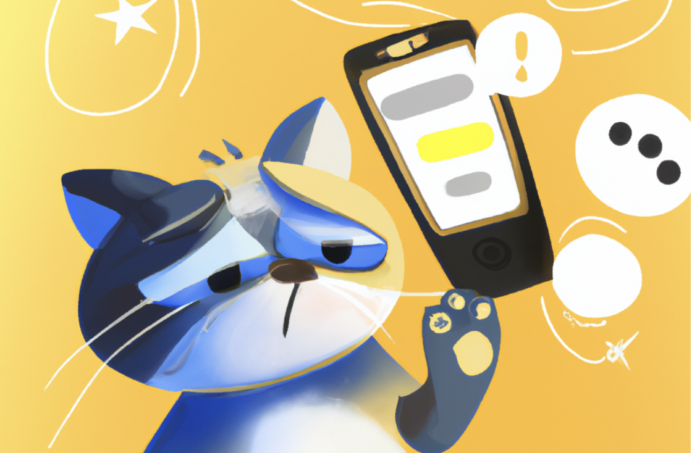
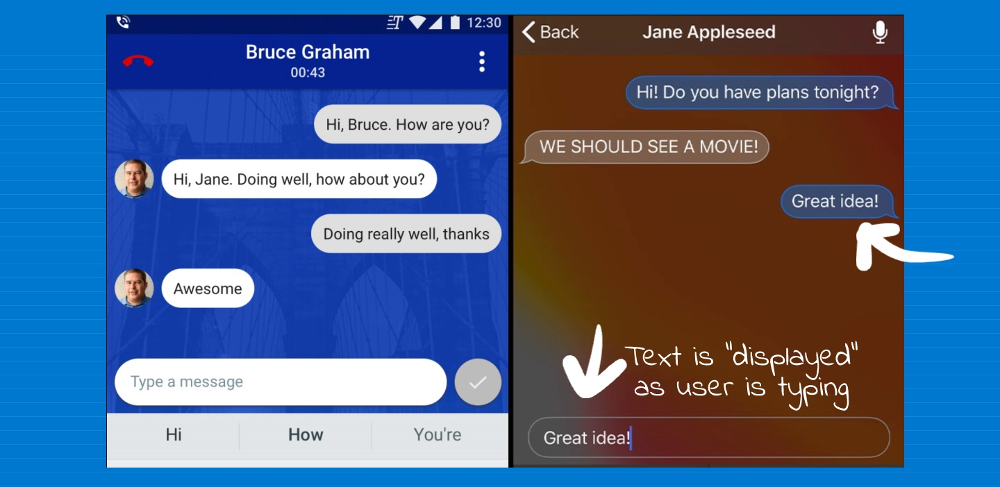

# Real Time Texting (Live Typing) - an Overview

Despite its popularity and convenience, **messaging consists of many similar limitations** as other computer-mediated communication (CMC) technology. One limitation of messaging is its [lack of social cues](). Social cues play a significant role in conversations as they influence a user’s perceived social presence, enjoyment, and usage intentions.

To enhance users’ perceived social presence, [is-typing indicator]() was introduced in instant messaging (IM) applications to support awareness of co-presence in real-time. The indicator, which **shows three moving dots (...)** or displays the message **_Person A is typing)_** was implemented for CMC systems to facilitate awareness by providing cues that the other person is typing. However, users can feel stresses and anxious while waiting for a message response and seeing three dots (...) for an extended period of time!

In this research project, we design a new interface that displays message as the user is writing it. That is, all messages would be shown [in real time]!! Real-time text (RTT) is [text transmitted instantly as it is typed or created](). **Recipients can immediately read the message while it is being written, without waiting.** RTT, or real-time text, sends text messages immediately as you type them, without requiring users to hit send.

`Figure 1: With real time text (or as we call it **Live Typing**, messages appear on the screen as you type them.`

# Brainstorming User Needs

After brainstorming on the limitations of the messaging applications, the next thing, in our journey, was to create some sketches - what does Live Typing mean for each user? All of us decided to brainstorm what does real time text application entail and how can we design an interface for users with different needs. 

Soon, we realise that designing for users is hard until we meet actual users and [ask them what they need](), a common practice in requirements engineering in UX. Hence, we decided to recruit participants to **inform us of their experiences** with common messaging applications and what would they change of improve in these applications. This activity stood as a pilot study to understand users' needs and challenges in their text-based interactions.

# Pilot Study - Designing Novel Ways for increasing "nonverbal cues" in Messaging

Before designing the interface, we recruited [24 participants]() for a sketching activity. The sketching activity had the following narrative:

`Imagine you are stressed out and you're in a bad mood. You don't prefer to call someone, and like to stay connected to your friends using texts. Your task is to think aloud of ways that you can improve the texting application to convey nonverbal cues. IN face to face communication, these cues are pauses, hesitations, gestures, and tone. How would you design a new interface to have some of these cues in texting applications? Please note this is not the design of an actual app.`

We [did not tell users about real time texting design](). We wanted to see if the concept emerges on it own.

<iframe style="border: 1px solid rgba(0, 0, 0, 0.1);" width="800" height="450" src="https://www.figma.com/embed?embed_host=share&url=https%3A%2F%2Fwww.figma.com%2Ffile%2FELovpx1WJWJEHecHB5MH6R%2FUntitled%3Fnode-id%3D0%253A1%26t%3Dn0pdUB4YthX9qx1S-1" allowfullscreen></iframe>

In our next project, we aspire to create the website and run a usability study to test for user experiences. Find the next project [here](https://sleepypinks.github.io/personas).

# Lessons Learned

While we had a hard-coded idea of how to convey non-verbal cues in messaging, our users differed in their responses. The pilot study helped us understand how users view nonverbal cues. The themes that emerged from our sketches included conveying non-verbal cues through various ways: [by creating avatars](), [voice memos](), [real time text]() and [speech bubbles](). While our research focuses on real time text (which is why we decided to go with this theme, future designers must always conduct a pilot study to brainstorm different user needs before they decide to design and ship a product.

***

[Navigate your way back to my projects](https://sleepypinks.github.io/) ❤️
