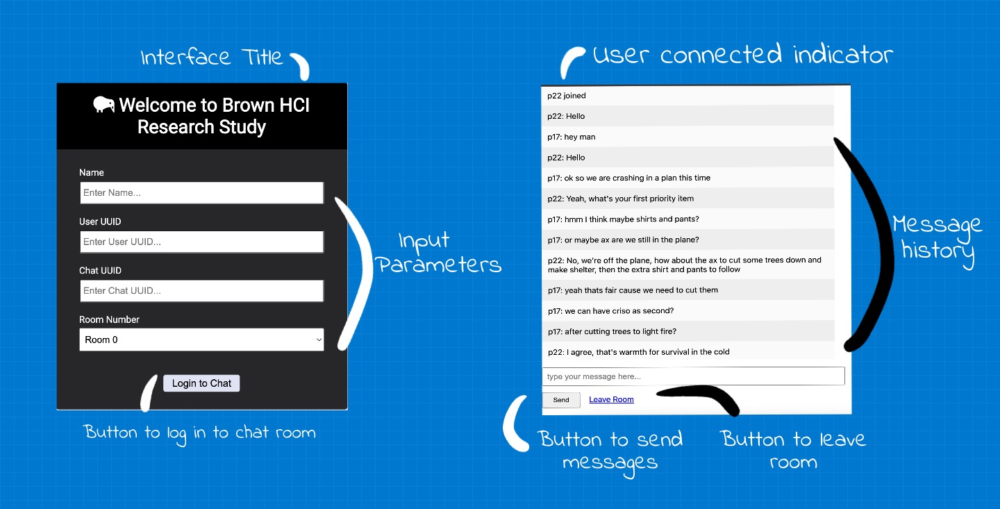

# Contextual Inquiry of Brown HCI's Live Typing Interface

In this study, we step in a user's shoes to observe their interaction with chat room designed to show messages as they are typed in real time. I observe users interactions with a [public chatroom](http://chatatbrownhci.herokuapp.com), what are users thinking when they interact with the interface and how do they behave. How does the interface make them "feel"? We combine these thoughts, feelings and behaviors and create three personas and one storyboard.

> What makes design good? Make it invisible.

***

<!---## Research Question --->

# Live Typing Interface

Despite its popularity and convenience, messaging consists of many similar limitations as other computer-mediated communication (CMC) technology. One limitation of messaging is its lack of social cues. Social cues play a significant role in conversations as they influence a user’s perceived social presence, enjoyment, and usage intentions. However, [facial expressions, tone, and emotions are not easily identified in messaging.]() This led us to design a new interface that shows messages in real time as they are being typed 

[Interface Objective: Increasing user's perceived co-presence.](http://chatatbrownhci.herokuapp.com)

***

# Public Observations

But does the said design increase the actual co-presence? To observe user's interaction with the system, we interviewed people and ask the following questions: 

## Home Screen

`Figure 1: Live Typing's homepage. Once the user clicks 'Log In', it takes them to the next screen i.e. the chat room.`

### User Interviews for Home Screen

Warm-up Questions | Questions for 'Home Screen'
-------|-------
What messaging apps do you use?  | What is the first thing you would do on this screen? 
Which app do you use the most? | Show me the things you would do before you press 'Log In'. 
What do you like about these apps? | What do you think will happen when you press 'Log In'? 

***

## Live Typing Screen 

`Figure 2: Live Typing's screen sketched out. User can see the other person's response in real time. The interface is trying to increase user's perceived social presence in written communication (messaging here) but displaying what the other person is typing 'on the go'.`

### User Interviews for Live Typing Screen

Questions for 'Live Typing'  | Post-Interaction Questions:
-------|-------
What is your first impression of 'live typing'? | What would motivate you to use this in your personal lives?
If you could change one thing about the design, what would it be?|  What was the one thing you disliked the most?
Please point to any items you would like to change on the screen. | Is there anything you would like to share?

***

# Interactions: How's it going for people?

## Key Observations

• Users were shocked which was recorded through interjections of 'wow', 'oh my', 'geez'.

• Live Typing made users feel reluctant. Some users did not write anything as they felt hesitant sharing their thoughts on the go.

• Whereas, live typing also helped some users communicate more. Users felt the interface helped them be more expressive. These observations were recorded by asking interview questions.

`Figure 3: User's state while interacting with an interface (Pictures from Adobe Stock).`

****

### Some of the summarized answers for most important patterns are as follows:

#### 1. [What is your first impression of 'live typing'?]() 

• Some users felt the interface was **communicative**.
• While others felt it **hindred their communication**.
• Some users felt it was privacy invasive while other felt it helped them bond.

****

#### 2. [If you could change one thing about the interface, what would it be?]()

• Most users felt **annoyed** seeing the home screen and so many input parameters.
• Most users wanted a logging in option with Facebook, Google or any third party apps.

****

#### 3. [Please point to any items you would like to change on the screen.]()

• For the home screen, **users did not feel comfortable** typing this many parameters. On the live typing screen, users were annoyed seeing "You connected" messages and wanted a green icon to see who was present.
• Some users **disliked the interface** as a chat room, and preffered 1:1 conversations.

****

# Personas and Empathy Maps

## Persona 1: Waiting Wyona

<iframe style="border: 1px solid rgba(0, 0, 0, 0.1);" width="800" height="450" src="https://www.figma.com/embed?embed_host=share&url=https%3A%2F%2Fwww.figma.com%2Ffile%2FaOOdjLYArd7Dfti21DC7pB%2FEmpathy-map-(Community)%3Fnode-id%3D502%253A491%26t%3DYyAXsSUkCtHIAYy5-1" allowfullscreen></iframe>

`Figure 5: Wyona is a graduate student and is in a long distance relationship. She uses online communication to stay in touch with her partner and her family.`

*****

## Persona 2: Privacy Aware Pamella

<iframe style="border: 1px solid rgba(0, 0, 0, 0.1);" width="800" height="450" src="https://www.figma.com/embed?embed_host=share&url=https%3A%2F%2Fwww.figma.com%2Ffile%2FaOOdjLYArd7Dfti21DC7pB%2FEmpathy-map-(Community)%3Fnode-id%3D506%253A146%26t%3DYyAXsSUkCtHIAYy5-1" allowfullscreen></iframe>

`Figure 6: Privacy Aware Pamella is a mother of two who is the head of Human Factors department at Apple. She takes privacy very seriously and does not allow any gadegts at home.`

*****

# Storyboarding

Let's see the user journey of Waiting Wyona. Remember that **Waiting Wyona is in a long distance relationship** and uses texting and calls to stay in touch with her friends, family and peers. In UX, we understand user journeys through storyboarding. Through this storyboard, we try to understand how

1. How Live Typing interface takes some stress away from Wiating Wyona as she is waiting for her partner's repsonse.
2. How we can make the design accessible for our users who feel stressed using messaging.

<iframe style="border: 1px solid rgba(0, 0, 0, 0.1);" width="800" height="450" src="https://www.figma.com/embed?embed_host=share&url=https%3A%2F%2Fwww.figma.com%2Ffile%2FkmR4OkiBp7dmZSfnqF4Cl5%2FStoryboard-Design-Exercise-(Copy)%3Fnode-id%3D0%253A1%26t%3Dq0Tr53ZPQ70VUojH-1" allowfullscreen></iframe>

*****

# Lessons Learned

Messages can be amazing as they let you type at your convenience and time. However, there are cases for users when messages can feel stressful. Users who have anxiety can have increased anxiety when their friend or partner is typing for too long and they have to see tree dots (...) for several minutes! This is why we created a [new chat room]() where users can see messages as the sender is typing them before they even hit _Send_! We then [conducted interviewes to understand users’ perceptions] of how the interfaces affected their communication and if they would use this chatroom in real lives. While several users were **uncomfortable**, we recorded polar observations where users who had high anxiety would appreciate this interface. Future designers should focus on how to redesign messaging interfaces that would reduce anxiety but would not cause feelings of distress.

[Navigate your way back to my projects](https://sleepypinks.github.io/projects) ❤️
