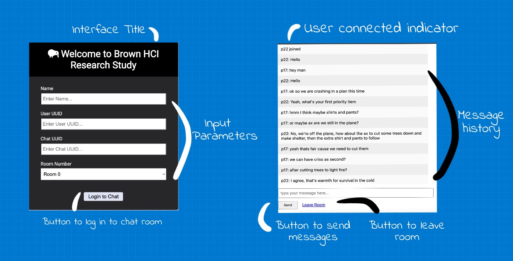

<!---## Overview

What makes design invisible? Make it good.

This project steps in a user's shoes on what goes on when users try to use a chat room. I observe users interactions with a [public chatroom](http://chatatbrownhci.herokuapp.com), what are users thinking when they interact with the interface and how do they behave. How does the interface make them "feel"? We combine these thoughts, feelings and behaviors and create three personas and one storyboard. --->

<!---## Research Question --->

## Overview 

Messages are annoying, frustrating and stressful. Those ... while we wait for our friend's message can induce stress, anxiety and apprehension. To better cater to these pesky feelings, a new chatroom is designed where users can see the message "on the go".

*****
[Interface Objective: Increasing user's perceived co-presence.](http://chatatbrownhci.herokuapp.com)
*****

## Interaction

But does the said design increase the actual co-presence? To observe user's interaction with the system, we interviewed people and ask the following questions: 

### Warm-up Questions
1. What messaging apps do you use?
2. Which app do you use the most?

### Questions for 'Home Screen' 
1. What is the first thing you would do on this screen?
2. Show me the things you would do before you press 'Log In'.
3. What do you think will happen when you press 'Log In'?
4. What are the things you would want to change on this screen?

### Questions for 'Live Typing' 
1. What is your first impression of 'live typing'?
2. What are you thinking as you see the other person's messages?
3. How do you feel knowing the other person is reading your message as you are writing?
4. If you could change one thing about the design, what would it be?
5. Please point to any items you would like to add to the screen.
6. Please point to any items you would not like to see on the screen.

### Post-Interaction Questions:
1. What would motivate you to use this in your personal lives?
2. What would keep you from using this chat room?
3. What was the one thing you liked the most?
4. What was the one thing you disliked the most?
5. How likely would you use these interfaces again? If not likely, why?
7. Is there anything you would like to share?
