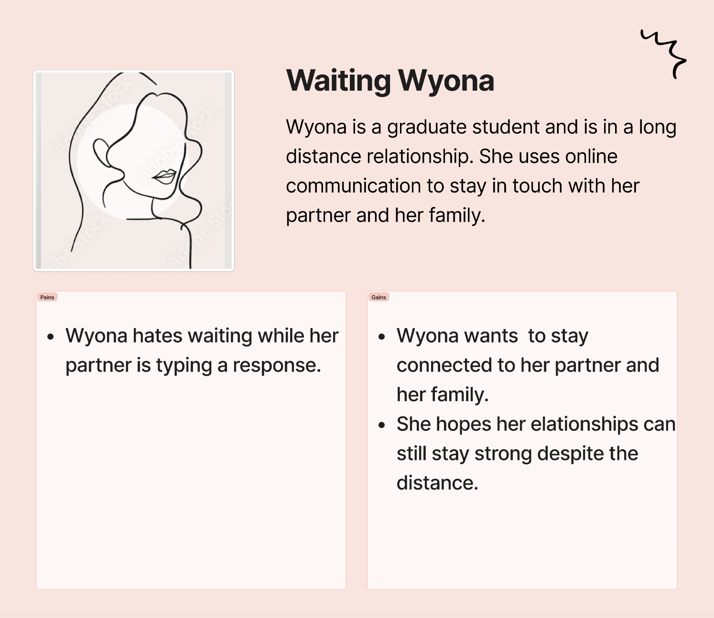

<!---## Overview

What makes design invisible? Make it good.

This project steps in a user's shoes on what goes on when users try to use a chat room. I observe users interactions with a [public chatroom](http://chatatbrownhci.herokuapp.com), what are users thinking when they interact with the interface and how do they behave. How does the interface make them "feel"? We combine these thoughts, feelings and behaviors and create three personas and one storyboard. --->

<!---## Research Question --->

## Overview: Live Typing Interface

Messages are annoying, frustrating and stressful. Those ... while we wait for our friend's message can induce stress, anxiety and apprehension. To better cater to these pesky feelings, a new chatroom is designed where users can see the message "on the go".

****

[Interface Objective: Increasing user's perceived co-presence.](http://chatatbrownhci.herokuapp.com)

*****

## Interaction

But does the said design increase the actual co-presence? To observe user's interaction with the system, we interviewed people and ask the following questions: 

*****
### Home Screen

*****

*Figure 1: Live Typing's homepage. Once the user clicks 'Log In', it takes them to the next screen i.e. the chat room.*

Warm-up Questions | Questions for 'Home Screen'
-------|-------
What messaging apps do you use?  | What is the first thing you would do on this screen? 
Which app do you use the most? | Show me the things you would do before you press 'Log In'. 
What do you like about these apps? | What do you think will happen when you press 'Log In'? 

*****

### Live Typing Screen

*****

*Figure 2: Live Typing's screen sketched out. User can see the other person's response in real time. The interface is trying to increase user's perceived social presence in written communication (messaging here) but displaying what the other person is typing 'on the go'.*

Questions for 'Live Typing'  | Post-Interaction Questions:
-------|-------
What is your first impression of 'live typing'? | What would motivate you to use this in your personal lives?
If you could change one thing about the design, what would it be?|  What was the one thing you disliked the most?
Please point to any items you would like to change on the screen. | Is there anything you would like to share?

*****

## Key Observations

• Users were shocked which was recorded through interjections of 'wow', 'oh my', 'geez'.

• Live Typing made users feel reluctant. Some users did not write anything as they felt hesitant sharing their thoughts on the go.

• Whereas, live typing also helped some users communicate more. Users felt the interface helped them be more expressive. These observations were recorded by asking interview questions.

*****

### Some of the summarized answers for most important patterns are as follows:

#### 1. What is your first impression of 'live typing'? 

• Some users felt the interface was communicative.

• While others felt it hindred their communication.

• Some users felt it was privacy invasive while other felt it helped them bond.

*****

#### 2. If you could change one thing about the interface, what would it be?

• Most users felt annoyed seeing the home screen and so many input parameters.

• Most users wanted a logging in option with Facebook, Google or any third party apps.

*****

#### 3. Please point to any items you would like to change on the screen.

• For the home screen, users did not feel comfortable typing this many parameters. On the live typing screen, users were annoyed seeing "You connected" messages and wanted a green icon to see who was present.

• Some users disliked the interface as a chat room, and preffered 1:1 conversations.

<!---  --->

*****

### Personas && Empathy Maps

#### Persona 1: Waiting Wyona: 

*****

#### Persona 2: Privacy Aware Pamella: 
Privacy Aware Pamella is a mother of two who is the head of Human Factors department at Apple. She takes privacy very seriously and does not allow any gadegts at home.

Thinks | Feels | Says | Does
-------|-------|-------|-------
a | b | c | d
*****
