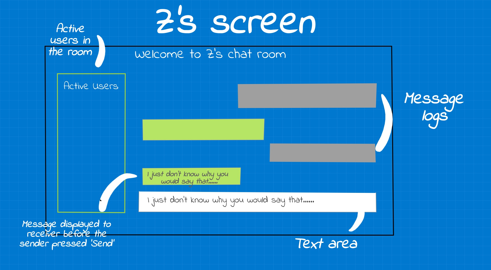

<!---## Overview

What makes design invisible? Make it good.

This project steps in a user's shoes on what goes on when users try to use a chat room. I observe users interactions with a [public chatroom](http://chatatbrownhci.herokuapp.com), what are users thinking when they interact with the interface and how do they behave. How does the interface make them "feel"? We combine these thoughts, feelings and behaviors and create three personas and one storyboard. --->

<!---## Research Question --->

## Overview: Live Typing Interface

Messages are annoying, frustrating and stressful. Those ... while we wait for our friend's message can induce stress, anxiety and apprehension. To better cater to these pesky feelings, a new chatroom is designed where users can see the message "on the go".

*Live Typing's homepage. Once the user clicks 'Log In', it takes them to the next screen i.e. the chat room.*

*****
[Interface Objective: Increasing user's perceived co-presence.](http://chatatbrownhci.herokuapp.com)
*****

## Interaction

But does the said design increase the actual co-presence? To observe user's interaction with the system, we interviewed people and ask the following questions: 

Warm-up Questions | Questions for 'Home Screen'
-----|-------
What messaging apps do you use?  | What is the first thing you would do on this screen? 
Which app do you use the most? | Show me the things you would do before you press 'Log In'. 
What do you like about these apps? | What do you think will happen when you press 'Log In'? 

*Live Typing's screen sketched out. User can see the other person's response in real time. The interface is trying to increase user's perceived social presence in written communication (messaging here) but displaying what the other person is typing 'on the go'.*

Questions for 'Live Typing'  | Post-Interaction Questions:
-----|-------
What is your first impression of 'live typing'? | What would motivate you to use this in your personal lives?
If you could change one thing about the design, what would it be?|  What was the one thing you disliked the most?
Please point to any items you would like to add to the screen. | Is there anything you would like to share?
