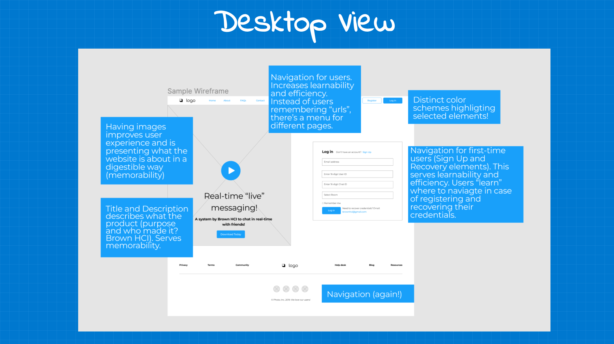
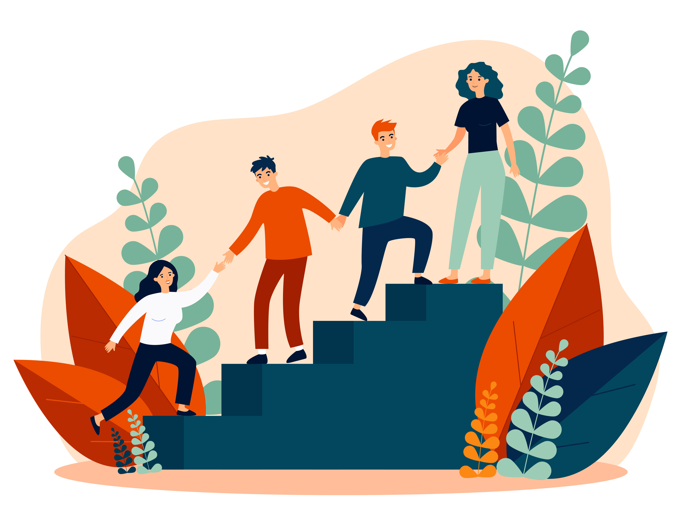

# Research Projects
👋 Here you can find a list of my research projects. Since I am a researcher, each of my project is provided with a **context**, **research question**, **process method to explore those questions**, and **lessons learned**. Happy navigating! :)

## [**Real-time texting - Design Strategies from a Pilot Study**]() [[project]](https://sleepypinks.github.io/livetyping)

Messages are annoying, frustrating and stressful. Those three dots… while we wait for our friend’s message can induce stress, anxiety and apprehension. To better cater to the lack of nonverbal cues, a new chatroom is designed where users can see the message “on the go”. We conducted a pilot study to **brainstorm design strategies** to increase presence in messaging.

`Role: UX Researcher`

***

## [**Exploring real-time text interface through personas and story-boarding**]() [[project]](https://sleepypinks.github.io/personas)

By observing and **interviewing real users** interacting with our real time texting website, we created personas based on these users. We then illustrate a storyboard for one of our personas.

`Role: UX Researcher`

***** 

## [**Redesigning texting interfaces for responsiveness**]() [[project]](https://sleepypinks.github.io/redesign)

By **identifying flaws** in an our real time texting interface, we created low-fidelity and high-fidelity prototypes for various screen sizes, and build a responsive website based on those prototypes.

`Role: UX Designer`

*** 

## [**Koko - Increasing social support and accessibility in mental health**]() [[project]](https://sleepypinks.github.io/koko)

We take a step back from designing messages for richer communication. In this project, we iteratively **designed an application** for a mental health startup.

`Role: Product Lead`

***
