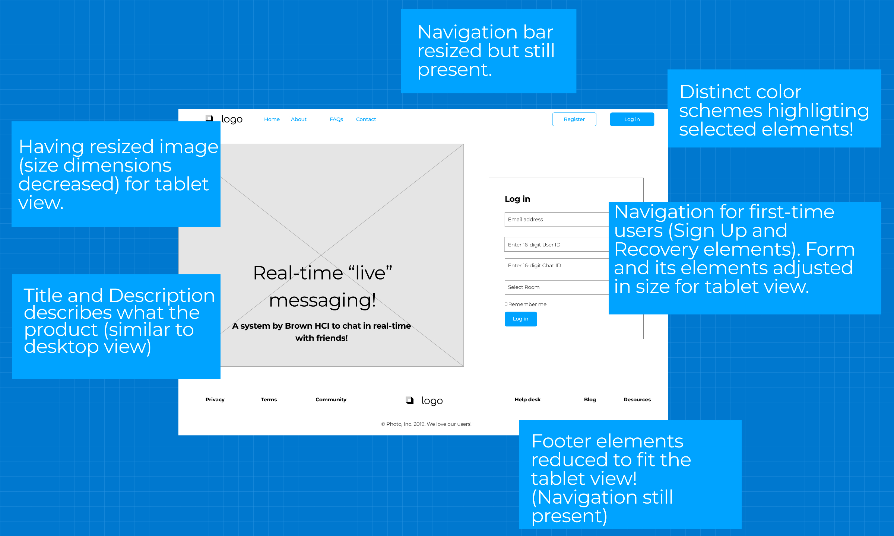
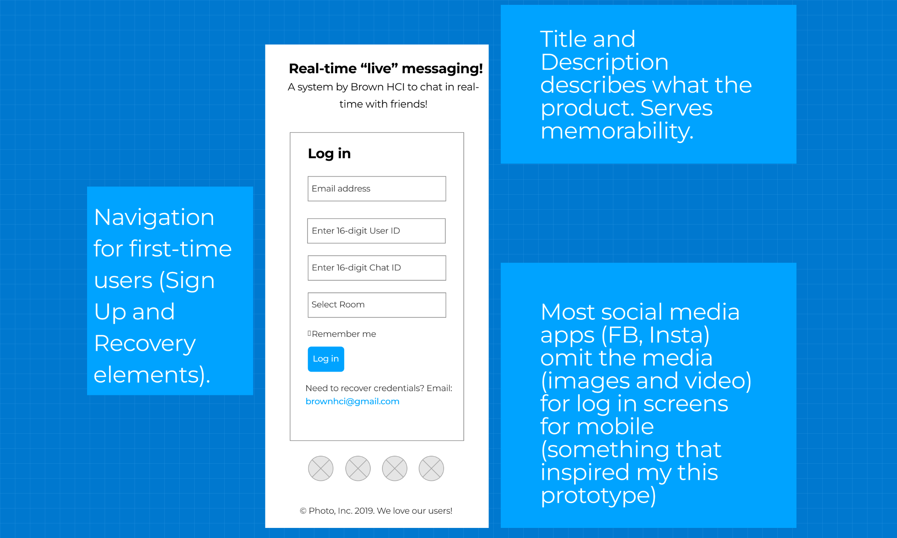

# Redesigning Brown HCI's Live Typing Interface for Usability

Messages are annoying, frustrating and stressful. Those ... while we wait for our friend's message can induce stress, anxiety and apprehension. To better cater to these pesky feelings, a new chatroom is designed where users can see the message "on the go".

[Interface Objective: Increasing user's perceived co-presence.](http://chatatbrownhci.herokuapp.com)

But, wait a second. That sign up page is not the best based on HCI's usability and accessibility standards. This page might not work for visually impaired, people with low vision, and probably can be too difficult to engage with for an average user as well. It also is not informative and memorable. The title says "Welcome to Brown HCI Research Study" - that's vague and anyone coming back to it would not remember what the study or interface was about.

****

# Usability Problems

_Excuse me, what did you say about my website?_ Angry Amy... is angry. She heard us talking about her website and has questions why we think its problematic. This is understandable, so let's walk Amy through some of the issues with the webpage.

• [Memorability](https://sleepypinks.github.io/redesign): The webpage scores good for memorability when it comes to input elements. All elements have a an appropriate placeholder which can help users to remember which credentials go where. However, the title of the website is **vague**. What is the purpose of this website? What kind of research is this website tied with? The current webpage in itself is not memorable for a user who would like to use this website after some months.

• [Learnability](https://sleepypinks.github.io/redesign): First-use learnability for novice users is not **user-friendly**. If someone, who does not have their login credentials yet, browse this website, they have no idea what to do (where do they sign up, who do they contact) in that case.

• [Efficiency](https://sleepypinks.github.io/redesign): Built on the point above, the web page holds good that it does not distract and serves for only log in purposes, but is **not designed efficiently** for _first time users_ or _someone who forgot their credentials_. Users might do trial and errors for extended period of time which could have been saved by having `Sign Up` or `Forgotten Credentials` options!

• [WAIVE]() report for the website detects no error but notifies that manual testing is required. This is a great insight into how a website might not have any errors and pass these "autonated" tests, but a manual check is always required. The website only has one element (form) and hence, therefore, it's hard to assess these errors through WAIVE report.

As explained above, I manually tested the website with a friend who has visual impairment and it was hard for her to assess the different form elements. The color scheme did not sit well with her, as visual impairment is of different types, and an automatic test like this can not catch all the errors. 

# Low-fidelity Wireframes

_I think I understand your point. But now what?_ Amy Angry has agreed that although the **actual website serves it purpose and is media-responsive**, it still lacks navigational components and proper description for a friendly user experience. The next thing, in our journey, is to create some sketches, also called lo-fidelity prototypes and show Amy what can the redesign website look like and how does [the new design resolve the issues in the current webpage](). Below we have sketched how we can redesign the Log In page for [Live Typing](chatatbrownhci.herokuapp.com).

`Figure 1: Live Typing's log in page redesigned for dektop.`

*****

_But my users don't access my website ONLY from their laptops_. We heard that, Amy, are some prototypes for different screen sizes, especially tablet and mobile.

`Figure 2: Live Typing's log in page redesigned for tablet.`

*****

`Figure 3: Live Typing's log in page redesigned for mobile.`

*****

# Visual Style Guides

Angry Amy is impressed. She has asked us to [conceptualise these wireframes](). She is confused about how we can make sure a user has consistent, coherent experience navigating her site without losing its functionality. Here, we present a style design guideline for Amy to materialise the concepts we have presented to her so far.

`Figure 4: Live Typing UI/UX Style Guide.`

*****

# Hi-Fidelity Prototype

Our Angry Amy has agreed to the visual style! She likes the contrasting theme (which was inspired by [Honk](). However, Amy is nor programmer, and does not know the CSS and HTML building blocks. Here we present the hi-fidelity prototypes for Amy and explain how we have redesigned our website. The website is currently a tad different but still [captures all the important elements] to address our usability issues!

First, we present the hi-fidelity prototypes for the desktop. [The code is attached with each explanation. Please note that this code will not change for tablet and mobile view.] Next, we adjust our css style to accomodate the tablet view. And lastly, we remove some elements to give a compact design for mobile-users.

<iframe style="border: 1px solid rgba(0, 0, 0, 0.1);" width="800" height="450" src="https://www.figma.com/embed?embed_host=share&url=https%3A%2F%2Fwww.figma.com%2Ffile%2FfszgJWpGlMmYIq8YzKVkUg%2FHifi-Design%3Fnode-id%3D0%253A1%26t%3DwTyH0OXCXjcBI6kk-1" allowfullscreen></iframe>

`Figure 5: Hi-fidelity prototype for Live Typing's Desktop, Tablet and Mobile View.`

Amy Angry requests access to the complete website. She wants to check for responsiveness herself. Well, [here you go](https://chatappforuiux.herokuapp.com/).
*****

# Lessons Learned

By redesigning Live Typing's screen for responsiveness, we learned the [importance of a smooth user experience]. For a consistent user experience, it is necessary to design for accessibility focusing on the [principles of learnability, memorability and efficiency]. Research is not design, and while the most important thing for researchers is to **produce findings**, researchers might still want to focus on the principles of UX design for their participants even if they don't want to release their projects.

***

[Navigate your way back to my projects](https://sleepypinks.github.io/projects) ❤️
